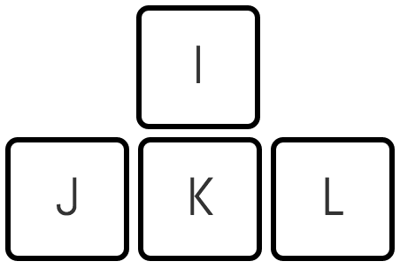

	 
	
	 

# Static Hands - Turn your Unused CapsLock Key a Superhero 🦸‍♂️🚀

⌨️ Minimal shortcuts with CapsLock that doesn't require moving hands. Super simple. No learning curve.

All of the shortcuts uses the CapsLock key, that 99% of programmers don't use 99% of their time. With static hands, you can let CapsLock turn your keyboard into a magical hands position fixed keyboard.

*Irrelevant for Vim users.

## Installation

First of all, install [AutoHotKey](https://www.autohotkey.com/). Then:
* **Option one**: Simply install the file by running the install.bat as an administrator (makes Static Hands load on the computer's startup).
* **Option two**: Install the file by clicking the install.exe (won't move Static Hands to startup folder).
* **Option three**: Clone project, run static-hands --> Windows --> run.ahk with AutoHotkey. To put ahk into effect automatically every time PC start

  * Select run.ahk, and press Ctrl+C.
  * Press Win+R to open the Run dialog, then enter shell:startup and click OK or Enter. This will open the Startup folder for the current user. To instead open the folder for all users, enter shell: common startup (however, in that case, you must be an administrator to proceed).
  * Right-click inside the window, and click "Paste Shortcut". The shortcut to the script should now be in the Startup folder.

## Static Hands vs Vim

Vim shortcuts are great, but they have a learning curve. And not a short one. Static Hands' shortcuts are super simple and quick. If you are already a vim user, you do not need this repo. And for us non-Vim users. The feature Vim users praise the most is the ability to move the cursor without changing hand position (HJKL keys). They actually like it so much they write plugins for every other program in the world to support the same shortcuts via “Vim modes”. The thing is that Vim mode is less intuitive (HJKL for arrows is much inconvenient than IJKL), and it forces more adaptation time.

## Basic Features

The Strength of these key bindings is in the shortcuts.
For example the shortcut Ctrl+Left Arrow is a great shortcut, but in reality that forces us, developers, to move our hands to the sides. We can now use CapsLock+f+j and get the same results without any effort. It'll take some time to fully get used to it, but it will pay off.

### Available commands

#### Left and Right Hand Key Bindings
|Key/Commands|Function|
|:----------:|:-------|
|CapsLock+j|Left|
|CapsLock+k|Down|
|CapsLock+i|Up|
|CapsLock+l|Right|
|CapsLock+u| To the start of the line (Home)|
|CapsLock+o| To the end of the line (End)|
|CapsLock+h| Delete|
|CapsLock+;| Backspace|
|CapsLock+'| Enter|
|CapsLock+p| Insert|
|CapsLock+y| PageUp|
|CapsLock+n| PageDown|
|CapsLock+-| Window always on top (toggle to turn off)|

#### Left Hand Key Bindings
|Key/Commands|Function|
|:----------:|:-------|
|CapsLock+f|Ctrl|
|CapsLock+d|Shift|
|CapsLock+s|Alt|
|CapsLock+w|Win Key|

* Notice one-click CapsLock still functions the same

### Speed

|Key/Commands|Function|
|:----------:|:-------|
|CapsLock+m| Move 5 words backward|
|CapsLock+.| Move 5 words forward|

### Case Changing

|Key/Commands|Function|
|:----------:|:-------|
|CapsLock+0|Upper Case|
|CapsLock+9|Lower Case|
|CapsLock+8|Title Case|