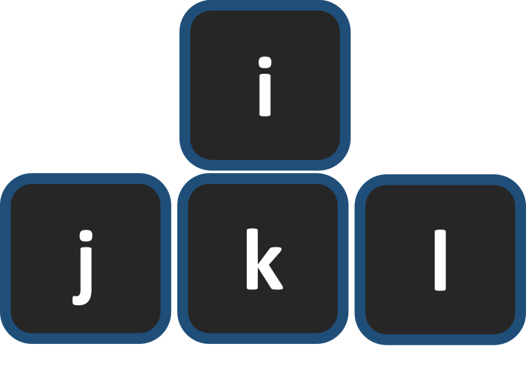

# Static Hands vs Vim

Vim shortcuts are great, but they have a learning curve. And not a short one. Static Hands' shortcuts are super simple and quick. If you are already a vim user, you do not need this repo. And for us non-Vim users. 

The feature Vim users praise the most is the ability to move the cursor without changing hand position (HJKL keys). They actually like it so much they write plugins for every other program in the world to support the same shortcuts via “Vim modes”. The thing is that Vim mode is less intuitive (HJKL for arrows is much inconvenient than IJKL), and it forces more adaptation time.